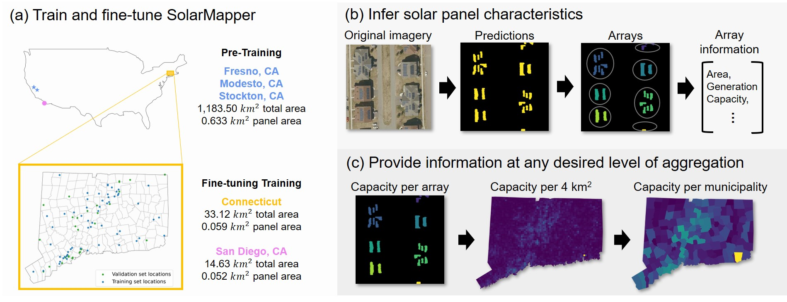

# SolarMapper with MRS (Models for Remote Sensing)

Code base and tutorials for the paper *SolarMapper: estimating solar array location, size, and capacity using deep learning and overhead imagery*.

## Usage

### Model training
1. Edit hyper-parameters in `config.json` or make your custom config file with the same format as `config.json`.
2. Run `python train.py --config CONFIG_PATH` if you're using your custom config file and `CONFIG_PATH` is the path to your config file. Without the `--config` flag, `train.py` will look for `config.json` in the `mrs` repo directory.

### Model evaluation
1. Edit settings parameters (GPU ID, model path, etc.) in `evaluate.py`. Notice that **`DS_NAME` should match the one in the config file of the trained model**.
2. Run `python evaluate.py`.

### Model inference
1. Edit settings parameters in `infer.py` in the same way as for model evaluation. `DS_NAME` should match the one in the trained model, too.
2. The `FILE_LIST` parameter takes the path to a `.txt` file which contains full paths of testing image files (one file path per row).
3. Run `python infer.py`.

## Tutorials

### [Dilation-based array grouping](./solarmapper_demo/dilation_based_grouping/dilation_based_grouping.ipynb)

### [Tile stratified sampling by building density](./solarmapper_demo/building_density_tile_stratified_sampling/stratified_ms_building.ipynb)

### Array-wise performance evaluation

## Please refer to the [original documentation of the MRS](https://github.com/waynehuu/mrs/blob/main/README.md) for more technical details about the framework.
